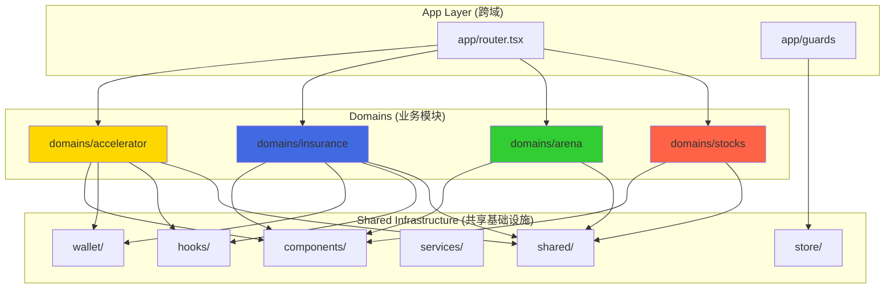

# LiqPass 多业务模块架构可行性评审报告

> **评审对象**: LiqPass 前端项目（1USD Accelerator / LiqPass 保险 / 策略区 / 未来新增模块）  
> **评审人**: 资深软件架构师 + 平台负责人  
> **评审日期**: 2026-01-21  
> **项目阶段**: Demo 阶段 → 产品化演进

---

## 📋 信息收集清单

在给出完整建议前，需要以下**核心信息**（如未提供，将基于默认假设）：

1. **部署策略**: 各模块是否需要独立域名/部署？还是共享一个主域名？
2. **团队规模**: 是否有多个团队并行开发不同模块？还是同一团队？
3. **发布频率**: 各模块的发布节奏是否一致？（如保险模块月更新，Accelerator 周更新）
4. **技术栈差异**: 是否有模块需要不同的技术栈？（如某模块需要用 Next.js SSR）
5. **权限隔离**: 模块间是否有严格的权限边界？（如管理员只能管理特定模块）
6. **数据共享**: 各模块是否需要实时共享用户数据/交易数据？
7. **流量级别**: 预期各模块的用户量级差异（如 Accelerator 日活 1 万，保险日活 100）
8. **合约依赖**: 各模块对应的智能合约是否独立部署？

### 🔍 当前假设（基于代码分析）

- ✅ 单团队开发，小规模迭代
- ✅ 统一域名，共享钱包登录
- ✅ Demo 阶段，快速验证 MVP
- ✅ 模块间低耦合（已有 `domains/` 结构）
- ✅ 共享设计系统和基础组件

---

## 1️⃣ 结论与建议

### 🎯 建议方案：**单仓多模块 + 懒加载路由**

| 维度 | 单仓多模块 | 多仓+统一入口 |
|------|-----------|--------------|
| **适用场景** | ✅ 当前阶段（Demo→产品化） | ⚠️ 规模化后（日活 10 万+） |
| **开发效率** | ⭐⭐⭐⭐⭐ 快速迭代，共享复用 | ⭐⭐⭐ 需要维护多套构建 |
| **部署灵活性** | ⭐⭐⭐ 按需拆分（Vite 支持代码分割） | ⭐⭐⭐⭐⭐ 可独立部署/回滚 |
| **代码复用** | ⭐⭐⭐⭐⭐ 组件/Hook/Util 直接共享 | ⭐⭐⭐ 需要 NPM 私有包或 monorepo |
| **技术债风险** | ⭐⭐⭐ 需要严格规范（否则耦合） | ⭐⭐⭐⭐ 强制边界，但维护成本高 |
| **团队协作** | ⭐⭐⭐⭐⭐ 小团队（1-5人）理想 | ⭐⭐⭐⭐ 多团队（5人以上）友好 |

### 📊 风险评级

| 风险项 | 风险等级 | 缓解措施 |
|--------|---------|---------|
| **全局状态污染** | 🟡 中 | 模块独立 Store，禁止跨域访问 |
| **依赖倒灌** | 🟢 低 | 严格 `domains/` 依赖规则（见下文） |
| **构建体积膨胀** | 🟡 中 | 按路由懒加载，共享代码提取公共 chunk |
| **模块间耦合** | 🟡 中 | 代码审查 + ESLint 规则 + 架构守卫测试 |
| **技术债累积** | 🟠 高（如不规范） | 定期重构 + 架构评审（每 3 个月） |

### ✅ 推荐理由

1. **你的代码已经在走这条路**：`domains/accelerator`、`domains/insurance` 等已经是模块化设计
2. **快速验证 MVP**：在 Demo 阶段避免过度工程化，保持敏捷
3. **平滑演进路径**：未来可通过 Vite 的 `manualChunks` 或迁移到 Nx monorepo 实现物理隔离
4. **成本可控**：无需额外的 CI/CD 配置、NPM 私有包或微前端框架

---

## 2️⃣ 模块边界定义

### 🧩 Domain 模型

| 模块名称 | Domain 边界 | 独立内容 | 可共享内容 |
|---------|------------|---------|-----------|
| **Accelerator (1USD)** | `domains/accelerator/` | • 项目列表/详情页面<br>• 投票/质押逻辑<br>• 奖池计算<br>• 合约交互 (`useAcceleratorContract`) | • 钱包连接<br>• 链配置<br>• UI 组件库 |
| **Insurance (保险)** | `domains/insurance/` | • 保单购买流程<br>• 理赔状态机<br>• 保费计算<br>• 风控 API 调用 | • 表单验证<br>• Toast 通知<br>• 权限守卫 |
| **Arena (策略区)** | `domains/arena/` | • 策略列表/详情<br>• 回测数据展示<br>• 复制交易逻辑 | • 图表库 (Recharts)<br>• 时间格式化工具 |
| **Stocks (量化比赛)** | `domains/stocks/` | • 比赛排行榜<br>• 参赛者管理<br>• 实时行情 WebSocket | • WebSocket 封装<br>• 分页组件 |
| **未来模块** | `domains/new-module/` | • 业务页面<br>• 业务状态<br>• 业务合约 | • 基础设施层 |

### 📂 每个模块的标准结构

```
domains/<module-name>/
├── pages/              # 页面组件（只能被 routes.ts 引用）
│   ├── ModuleHomePage.tsx
│   ├── ModuleDetailPage.tsx
│   └── ...
├── components/         # 模块私有组件（不能被其他域引用）
│   ├── ModuleCard.tsx
│   └── ModuleForm.tsx
├── hooks/              # 模块业务 Hook
│   ├── useModuleData.ts
│   └── useModuleSubmit.ts
├── services/           # API 调用层
│   └── moduleApi.ts
├── store/              # Zustand 模块状态
│   └── moduleStore.ts
├── contracts/          # 智能合约交互
│   └── useModuleContract.ts
├── types/              # 模块类型定义
│   └── index.ts
├── utils/              # 模块工具函数
│   └── calculations.ts
└── routes.ts           # 模块路由配置（导出到 app/router.tsx）
```

### 🚫 禁止事项

| 禁止行为 | 正确做法 |
|---------|---------|
| ❌ `domains/accelerator` 导入 `domains/insurance` | ✅ 通过 `shared/` 或事件总线通信 |
| ❌ 在 `pages/` 里写业务逻辑 | ✅ 逻辑放 `hooks/` 或 `services/` |
| ❌ 全局状态存储所有模块数据 | ✅ 每个模块独立 Zustand store |
| ❌ 组件库 `components/` 混杂业务逻辑 | ✅ 组件只负责展示，业务逻辑在 `domains/` |

---

## 3️⃣ 共享策略清单

### ✅ **可以共享（Infrastructure Layer）**

| 类型 | 位置 | 示例 |
|------|------|-----|
| **钱包连接** | `wallet/` | RainbowKit 配置、钱包状态同步 |
| **链配置** | `config/chains.ts` | 支持的链、RPC 节点、区块浏览器 |
| **UI 组件库** | `components/` | Button、Card、Modal、Form 等无业务组件 |
| **布局组件** | `components/Layout.tsx` | 顶部导航、侧边栏、Footer |
| **路由守卫** | `app/guards/` | RequireRole、RequireWallet |
| **通用 Hook** | `hooks/` | useDebounce、useLocalStorage、useMediaQuery |
| **工具函数** | `shared/utils/` | 时间格式化、数字格式化、地址截断 |
| **类型定义** | `shared/types/` | 链 ID 枚举、用户角色 enum |
| **设计令牌** | `index.css` (Tailwind) | 颜色、间距、圆角、阴影 |
| **日志/监控** | `shared/logger.ts` | Sentry、埋点 SDK |

### 🚫 **禁止共享（Domain-Specific）**

| 类型 | 原因 | 正确做法 |
|------|------|---------|
| **业务状态** | 避免耦合，各模块状态独立 | 每个 domain 自己的 `store/` |
| **定价/风控逻辑** | 业务核心，不能被其他模块篡改 | 封装在 `domains/<name>/services/` |
| **数据库表/API** | 强业务属性，避免跨域调用 | 通过 BFF 层隔离 |
| **合约 ABI/地址** | 版本管理独立，避免误用 | `domains/<name>/contracts/` |
| **页面级组件** | 页面是模块边界，不能复用 | 如需复用，抽象成通用组件放 `components/` |
| **路由配置** | 各模块路由独立维护 | `domains/<name>/routes.ts` 导出 |

### 🔀 **条件共享（需要抽象）**

| 场景 | 抽象方式 | 示例 |
|------|---------|-----|
| **模块间通信** | 事件总线或全局状态 | `shared/eventBus.ts` 发布订阅模式 |
| **共享数据缓存** | React Query 全局缓存 | `shared/queryClient.ts` |
| **错误处理** | 统一错误边界 | `components/common/ErrorBoundary.tsx` |
| **表单验证** | Schema 层 | `shared/schemas/` 使用 Zod |

---

## 4️⃣ 推荐架构方案

### 🏗️ 前端目录结构

```
liqpass-frontend/
├── src/
│   ├── app/                     # 应用核心（跨域）
│   │   ├── router.tsx           # 路由聚合器（汇总各 domain routes）
│   │   ├── guards/              # 路由守卫
│   │   │   ├── RequireRole.tsx
│   │   │   └── RequireWallet.tsx
│   │   └── pages/               # 跨域页面
│   │       ├── LoginRequiredPage.tsx
│   │       └── ForbiddenPage.tsx
│   │
│   ├── domains/                 # 业务模块（核心）
│   │   ├── accelerator/         # 1USD Accelerator 模块
│   │   │   ├── pages/
│   │   │   │   ├── AcceleratorHomePage.tsx
│   │   │   │   ├── ProjectDetailPage.tsx
│   │   │   │   └── AdminPage.tsx
│   │   │   ├── components/
│   │   │   │   ├── ProjectCard.tsx
│   │   │   │   └── VotingPanel.tsx
│   │   │   ├── hooks/
│   │   │   │   ├── useProjectList.ts
│   │   │   │   └── useVoting.ts
│   │   │   ├── services/
│   │   │   │   └── acceleratorApi.ts
│   │   │   ├── store/
│   │   │   │   └── acceleratorStore.ts
│   │   │   ├── contracts/
│   │   │   │   ├── abi.ts
│   │   │   │   └── useAcceleratorContract.ts
│   │   │   ├── types/
│   │   │   │   └── index.ts
│   │   │   └── routes.ts        # ⚠️ 导出路由配置
│   │   │
│   │   ├── insurance/           # 保险模块
│   │   │   ├── pages/
│   │   │   │   ├── InsuranceHomePage.tsx
│   │   │   │   ├── PurchasePage.tsx
│   │   │   │   └── ClaimPage.tsx
│   │   │   ├── components/
│   │   │   ├── hooks/
│   │   │   ├── services/
│   │   │   ├── store/
│   │   │   ├── contracts/
│   │   │   └── routes.ts
│   │   │
│   │   ├── arena/               # 策略区模块
│   │   │   └── ... (同上结构)
│   │   │
│   │   └── stocks/              # 量化比赛模块
│   │       └── ... (同上结构)
│   │
│   ├── components/              # 共享 UI 组件（无业务逻辑）
│   │   ├── common/
│   │   │   ├── Button.tsx
│   │   │   ├── Card.tsx
│   │   │   ├── Modal.tsx
│   │   │   └── ErrorBoundary.tsx
│   │   ├── Layout.tsx
│   │   └── Navbar.tsx
│   │
│   ├── wallet/                  # 钱包层（共享）
│   │   ├── config.ts            # RainbowKit 配置
│   │   ├── useSyncWalletToStore.ts
│   │   └── hooks/
│   │       └── useConnectWallet.ts
│   │
│   ├── hooks/                   # 通用 Hook（无业务逻辑）
│   │   ├── useDebounce.ts
│   │   ├── useLocalStorage.ts
│   │   └── useMediaQuery.ts
│   │
│   ├── services/                # 共享服务层
│   │   ├── api/
│   │   │   ├── client.ts        # Axios/Fetch 配置
│   │   │   └── interceptors.ts
│   │   └── analytics/
│   │       └── tracker.ts       # 埋点
│   │
│   ├── shared/                  # 共享工具/类型
│   │   ├── utils/
│   │   │   ├── formatters.ts    # 时间/数字格式化
│   │   │   ├── validators.ts
│   │   │   └── constants.ts
│   │   ├── types/
│   │   │   └── common.ts        # 全局类型
│   │   ├── schemas/             # Zod Schema
│   │   │   └── formSchemas.ts
│   │   └── eventBus.ts          # 模块间通信（可选）
│   │
│   ├── store/                   # 全局状态（仅基础设施）
│   │   ├── authStore.ts         # 用户登录状态
│   │   ├── themeStore.ts        # 主题切换
│   │   └── walletStore.ts       # 钱包连接状态
│   │
│   ├── config/
│   │   ├── chains.ts            # 链配置
│   │   └── env.ts               # 环境变量
│   │
│   ├── index.css                # 全局样式 + Tailwind
│   └── main.tsx                 # 应用入口
│
├── contracts/                   # 智能合约（可选，推荐独立仓库）
│   ├── accelerator/
│   ├── insurance/
│   └── ...
│
├── docs/                        # 文档
│   ├── architecture.md          # 架构决策记录 (ADR)
│   └── module-guide.md          # 模块开发指南
│
├── .husky/                      # Git Hooks
│   └── pre-commit               # 运行 lint + typecheck
│
├── vite.config.ts               # Vite 配置（代码分割）
├── tailwind.config.js
├── tsconfig.json
└── package.json
```

### 🔗 模块依赖关系图



### 📦 Vite 配置（代码分割）

```typescript
// vite.config.ts
import { defineConfig } from 'vite'
import react from '@vitejs/plugin-react'

export default defineConfig({
  plugins: [react()],
  build: {
    rollupOptions: {
      output: {
        manualChunks: {
          // 共享基础库
          'vendor-react': ['react', 'react-dom', 'react-router-dom'],
          'vendor-web3': ['wagmi', 'viem', '@rainbow-me/rainbowkit'],
          
          // 各模块独立打包
          'domain-accelerator': [
            './src/domains/accelerator/pages',
            './src/domains/accelerator/components',
          ],
          'domain-insurance': [
            './src/domains/insurance/pages',
            './src/domains/insurance/components',
          ],
          'domain-arena': [
            './src/domains/arena/pages',
          ],
          'domain-stocks': [
            './src/domains/stocks/pages',
          ],
        },
      },
    },
  },
})
```

---

## 5️⃣ 十大架构陷阱与规避手段

### 1. 🔴 全局状态污染

**问题**：
```typescript
// ❌ 错误：所有模块数据塞进一个 store
const useGlobalStore = create((set) => ({
  acceleratorProjects: [],
  insurancePolicies: [],
  arenaStrategies: [],
  // ... 变成上帝对象
}))
```

**规避**：
```typescript
// ✅ 正确：每个模块独立 store
// domains/accelerator/store/projectStore.ts
export const useProjectStore = create((set) => ({
  projects: [],
  selectedProject: null,
}))

// domains/insurance/store/policyStore.ts
export const usePolicyStore = create((set) => ({
  policies: [],
  activeClaim: null,
}))
```

**检测手段**：ESLint 规则禁止跨域导入 store
```javascript
// .eslintrc.cjs
rules: {
  'no-restricted-imports': [
    'error',
    {
      patterns: [
        {
          group: ['**/domains/*/store'],
          message: '禁止跨域导入 store，请使用事件总线或 React Query',
        },
      ],
    },
  ],
}
```

---

### 2. 🔴 依赖倒灌（Domain 互相依赖）

**问题**：
```typescript
// ❌ domains/insurance/pages/InsurancePage.tsx
import { ProjectCard } from '../../accelerator/components/ProjectCard'
```

**规避**：
```typescript
// ✅ 共享组件提升到 components/
// components/common/GenericCard.tsx（抽象通用能力）

// 或使用组合模式
// domains/insurance/pages/InsurancePage.tsx
import { Card } from '@/components/common/Card'
```

**架构守卫测试**：
```typescript
// src/test/architecture.test.ts
import { describe, it, expect } from 'vitest'
import { exec } from 'child_process'

describe('Architecture Rules', () => {
  it('domains should not import from other domains', async () => {
    const result = await exec(
      'grep -r "from.*domains/" src/domains/accelerator --exclude-dir=node_modules'
    )
    expect(result).not.toContain('domains/insurance')
    expect(result).not.toContain('domains/arena')
  })
})
```

---

### 3. 🔴 共享组件变成上帝组件

**问题**：
```typescript
// ❌ components/Card.tsx 被塞满各种业务逻辑
<Card
  mode="accelerator" // 业务 mode
  onVote={...}        // Accelerator 专属
  onClaim={...}       // Insurance 专属
  showChart={...}     // Arena 专属
/>
```

**规避**：
```typescript
// ✅ 组件只负责展示，业务逻辑在 domains/
// components/common/Card.tsx（无业务逻辑）
export const Card = ({ children, ...props }) => (
  <div className="rounded border p-4" {...props}>
    {children}
  </div>
)

// domains/accelerator/components/ProjectCard.tsx
import { Card } from '@/components/common/Card'
export const ProjectCard = ({ project }) => (
  <Card>
    <h3>{project.name}</h3>
    <VotingButton projectId={project.id} />
  </Card>
)
```

**审查清单**：
- [ ] 组件是否只接受 `children` 和样式 props？
- [ ] 是否依赖特定业务类型（如 `Project` 类型）？
- [ ] 是否包含 API 调用或状态管理？

---

### 4. 🔴 RPC/链切换混乱

**问题**：
```typescript
// ❌ 各模块自己定义链配置
// domains/accelerator/config.ts
const chains = [mainnet, polygon]

// domains/insurance/config.ts
const chains = [mainnet, arbitrum] // 不一致！
```

**规避**：
```typescript
// ✅ 统一链配置
// config/chains.ts
export const SUPPORTED_CHAINS = {
  mainnet: { id: 1, rpc: '...', ... },
  polygon: { id: 137, rpc: '...', ... },
}

// wallet/config.ts
import { SUPPORTED_CHAINS } from '@/config/chains'
export const wagmiConfig = createConfig({
  chains: Object.values(SUPPORTED_CHAINS),
})

// domains/accelerator/contracts/useContract.ts
import { SUPPORTED_CHAINS } from '@/config/chains'
const CONTRACT_ADDRESSES = {
  [SUPPORTED_CHAINS.mainnet.id]: '0x123...',
}
```

---

### 5. 🔴 路由冲突

**问题**：
```typescript
// ❌ domains/accelerator/routes.ts
{ path: '/dashboard', element: <AcceleratorDashboard /> }

// ❌ domains/insurance/routes.ts
{ path: '/dashboard', element: <InsuranceDashboard /> } // 冲突！
```

**规避**：
```typescript
// ✅ 路由加模块前缀
// domains/accelerator/routes.ts
export const acceleratorRoutes = [
  { path: '/accelerator/dashboard', element: <AcceleratorDashboard /> },
  { path: '/accelerator/projects/:id', element: <ProjectDetail /> },
]

// domains/insurance/routes.ts
export const insuranceRoutes = [
  { path: '/insurance/dashboard', element: <InsuranceDashboard /> },
  { path: '/insurance/policies/:id', element: <PolicyDetail /> },
]

// app/router.tsx
const routes = [
  ...acceleratorRoutes,
  ...insuranceRoutes,
]
```

**命名规范**：
| 模块 | 路由前缀 | 示例 |
|------|---------|-----|
| Accelerator | `/accelerator/*` | `/accelerator/projects`, `/accelerator/admin` |
| Insurance | `/insurance/*` | `/insurance/policies`, `/insurance/claims` |
| Arena | `/arena/*` | `/arena/strategies`, `/arena/rankings` |
| Stocks | `/stocks/*` | `/stocks/research`, `/stocks/portfolio` |

---

### 6. 🔴 构建体积膨胀

**问题**：
```bash
# 打包后发现所有模块代码都在一个 bundle 里
dist/
└── assets/
    └── index-a1b2c3d4.js  # 5MB！
```

**规避**：
```typescript
// vite.config.ts（见上文第 4 节）
// 配置 manualChunks 按模块分割

// 路由懒加载
const AcceleratorHome = lazy(() => import('./domains/accelerator/pages/AcceleratorHomePage'))
const InsuranceHome = lazy(() => import('./domains/insurance/pages/InsuranceHomePage'))

// 结果
dist/
└── assets/
    ├── vendor-react.js          # 200KB
    ├── vendor-web3.js           # 300KB
    ├── domain-accelerator.js    # 150KB
    ├── domain-insurance.js      # 100KB
    └── ...
```

**检测**：
```bash
npm run build
npx vite-bundle-visualizer
```

---

### 7. 🔴 类型定义重复

**问题**：
```typescript
// ❌ 各模块重复定义相同类型
// domains/accelerator/types.ts
type User = { address: string; role: string }

// domains/insurance/types.ts
type User = { address: string; role: string } // 重复！
```

**规避**：
```typescript
// ✅ 共享类型放 shared/types/
// shared/types/user.ts
export type User = {
  address: `0x${string}`
  role: 'user' | 'admin'
  connectedAt: Date
}

// shared/types/chain.ts
export type ChainId = 1 | 137 | 42161

// domains/accelerator/types.ts（业务特定类型）
import type { User } from '@/shared/types/user'
export type Project = {
  id: string
  creator: User // 复用共享类型
  fundingGoal: bigint
}
```

---

### 8. 🔴 环境变量混乱

**问题**：
```typescript
// ❌ 各模块硬编码 API 地址
// domains/accelerator/services/api.ts
const API_URL = 'https://api.example.com/accelerator'

// domains/insurance/services/api.ts
const API_URL = 'https://api.example.com/insurance'
```

**规避**：
```typescript
// ✅ 统一环境变量管理
// config/env.ts
export const ENV = {
  API_BASE_URL: import.meta.env.VITE_API_BASE_URL,
  ACCELERATOR_CONTRACT: import.meta.env.VITE_ACCELERATOR_CONTRACT,
  INSURANCE_CONTRACT: import.meta.env.VITE_INSURANCE_CONTRACT,
}

// .env.example
VITE_API_BASE_URL=https://api.example.com
VITE_ACCELERATOR_CONTRACT=0x123...
VITE_INSURANCE_CONTRACT=0x456...

// domains/accelerator/services/api.ts
import { ENV } from '@/config/env'
const apiClient = axios.create({
  baseURL: `${ENV.API_BASE_URL}/accelerator`,
})
```

---

### 9. 🔴 模块间通信耦合

**问题**：
```typescript
// ❌ 直接调用其他模块的函数
// domains/accelerator/hooks/useVoting.ts
import { usePolicyStore } from '../../insurance/store/policyStore'
const { activeClaim } = usePolicyStore() // 耦合！
```

**规避**：
```typescript
// ✅ 方案 1: 事件总线（发布订阅）
// shared/eventBus.ts
import mitt from 'mitt'
export const eventBus = mitt<{
  'user:voted': { projectId: string; amount: number }
  'policy:purchased': { policyId: string }
}>()

// domains/accelerator/hooks/useVoting.ts
import { eventBus } from '@/shared/eventBus'
const handleVote = () => {
  eventBus.emit('user:voted', { projectId, amount })
}

// domains/insurance/hooks/useInsuranceTrigger.ts
eventBus.on('user:voted', ({ projectId }) => {
  // 监听投票事件，触发保险推荐
})

// ✅ 方案 2: React Query 全局缓存
// shared/queryClient.ts
export const queryClient = new QueryClient()

// domains/accelerator/hooks/useProjectList.ts
useQuery({ queryKey: ['projects'], queryFn: fetchProjects })

// domains/insurance/hooks/useRelatedProjects.ts
const { data } = useQuery({ queryKey: ['projects'] }) // 共享缓存
```

---

### 10. 🔴 测试隔离失败

**问题**：
```typescript
// ❌ 测试时所有模块都初始化
// __tests__/accelerator.test.tsx
import { render } from '@testing-library/react'
import App from '@/App' // 加载了所有模块！
```

**规避**：
```typescript
// ✅ 测试只导入被测模块
// domains/accelerator/__tests__/ProjectCard.test.tsx
import { render } from '@testing-library/react'
import { ProjectCard } from '../components/ProjectCard'

test('renders project name', () => {
  const project = { id: '1', name: 'Test' }
  const { getByText } = render(<ProjectCard project={project} />)
  expect(getByText('Test')).toBeInTheDocument()
})

// Mock 共享依赖
vi.mock('@/wallet/useSyncWalletToStore', () => ({
  useSyncWalletToStore: vi.fn(),
}))
```

---

## 6️⃣ 演进路线

### 🌱 阶段 1: Demo 阶段（现在，1-2 个月）

**目标**: 快速验证 MVP，保持敏捷

#### 行动清单
- [x] ✅ 已有：`domains/` 结构（accelerator、insurance、arena、stocks）
- [ ] 📝 创建 `docs/module-guide.md` 文档（开发规范）
- [ ] 🧹 清理跨域依赖（运行架构守卫测试）
- [ ] 🔧 配置 Vite `manualChunks`（按模块分割）
- [ ] 📊 添加 Bundle Analyzer（监控体积）

#### 可以偷懒的地方
- ❌ 暂不需要微前端框架（qiankun/Micro-App）
- ❌ 暂不需要 Monorepo 工具（Nx/Turborepo）
- ❌ 暂不需要独立部署（统一域名即可）
- ⚠️ 可以暂时共享一些业务逻辑（但需要标记 `// TODO: 抽象到 domain`）

#### 技术债务记录
```typescript
// domains/accelerator/hooks/useProjectList.ts
// TODO(architecture): 这个 Hook 被 insurance 模块使用，需要抽象到 shared/
export const useProjectList = () => { ... }
```

---

### 🌿 阶段 2: 产品化（3-6 个月）

**目标**: 清理技术债，建立规范

#### 行动清单
- [ ] 📦 **升级到 Monorepo**（Nx 或 pnpm workspace）
  ```
  apps/
  ├── web/              # 主应用
  └── admin/            # 管理后台（可选独立）
  packages/
  ├── ui/               # 共享组件库（发布为 @liqpass/ui）
  ├── contracts/        # 智能合约交互层
  └── shared/           # 工具函数
  ```
- [ ] 🧪 **提升测试覆盖率**（单元测试 60%+）
- [ ] 📐 **引入架构守卫**（Dependency Cruiser/eslint-plugin-boundaries）
- [ ] 📚 **文档完善**
  - API 文档（Swagger/TypeDoc）
  - 组件库文档（Storybook）
  - 架构决策记录（ADR）

#### 性能优化
```typescript
// 按路由预加载
import { prefetchQuery } from '@tanstack/react-query'
const handleRouteChange = (path) => {
  if (path.startsWith('/accelerator')) {
    prefetchQuery({ queryKey: ['projects'], queryFn: fetchProjects })
  }
}
```

---

### 🌳 阶段 3: 规模化（6-12 个月）

**目标**: 支持大规模流量，独立部署

#### 迁移到微前端

**触发条件**（满足 3 个及以上）：
- [ ] 日活用户 10 万+
- [ ] 多团队并行开发（5+ 人）
- [ ] 模块发布频率差异大（如 Accelerator 周更新，Insurance 月更新）
- [ ] 需要独立回滚某个模块
- [ ] 主应用构建时间超过 5 分钟

**方案选择**：

| 方案 | 适用场景 | 优点 | 缺点 |
|------|---------|-----|-----|
| **qiankun (推荐)** | 统一域名，子应用独立部署 | • 生态成熟<br>• 样式隔离<br>• 通信方便 | • 需要改造现有应用 |
| **Module Federation** | Webpack/Vite 5+ | • 原生支持<br>• 共享依赖 | • 配置复杂<br>• 需要同版本构建工具 |
| **iframe** | 强隔离需求 | • 完全隔离<br>• 技术栈无限制 | • 性能差<br>• 通信复杂 |

**迁移路径**：
```typescript
// 主应用
import { registerMicroApps, start } from 'qiankun'

registerMicroApps([
  {
    name: 'accelerator',
    entry: '//localhost:3001',
    container: '#subapp-viewport',
    activeRule: '/accelerator',
  },
  {
    name: 'insurance',
    entry: '//localhost:3002',
    container: '#subapp-viewport',
    activeRule: '/insurance',
  },
])

start()
```

---

## 7️⃣ 验收清单（合并到一个框架的 Gate）

### ✅ 代码结构验收

- [ ] **模块独立性**
  - [ ] 每个模块有独立的 `routes.ts`
  - [ ] 模块内代码不导入其他模块的 `pages/`、`components/`、`store/`
  - [ ] 共享代码在 `components/`、`shared/`、`wallet/`、`hooks/` 等公共目录

- [ ] **依赖清晰**
  - [ ] 运行架构守卫测试通过（`npm run test:architecture`）
  - [ ] ESLint 规则检查通过（`npm run lint`）
  - [ ] `grep -r "from.*domains/" src/domains/` 不包含跨域导入

- [ ] **类型安全**
  - [ ] TypeScript 编译无错误（`npm run typecheck`）
  - [ ] 共享类型在 `shared/types/`
  - [ ] 模块特定类型在各自 `domains/<name>/types/`

---

### ✅ 功能验收

- [ ] **路由隔离**
  - [ ] 各模块路由有独立前缀（如 `/accelerator/*`、`/insurance/*`）
  - [ ] 路由懒加载配置正确（`React.lazy`）
  - [ ] 测试：访问 `/accelerator/projects` 时，不加载 insurance 代码

- [ ] **状态隔离**
  - [ ] 每个模块有独立的 Zustand store
  - [ ] 全局 store 只包含基础设施数据（钱包、主题、用户登录状态）
  - [ ] 测试：Insurance 模块刷新时，不影响 Accelerator 模块状态

- [ ] **样式隔离**
  - [ ] 模块特定样式在各自目录（或使用 CSS Modules/Tailwind）
  - [ ] 没有全局样式覆盖（除了 `index.css` 的基础样式）
  - [ ] 测试：Insurance 主题色不影响 Accelerator 页面

---

### ✅ 性能验收

- [ ] **代码分割**
  - [ ] 首屏加载体积 < 500KB（gzip 后）
  - [ ] 各模块代码独立打包（运行 `npm run build`，查看 `dist/assets/`）
  - [ ] Lighthouse Performance 分数 > 90

- [ ] **懒加载**
  - [ ] 访问 `/accelerator` 时不加载 `/insurance` 代码
  - [ ] Network 面板验证：只加载当前模块的 chunk

---

### ✅ 开发体验验收

- [ ] **文档完善**
  - [ ] `docs/module-guide.md` 包含模块开发规范
  - [ ] `docs/architecture.md` 记录架构决策
  - [ ] README 包含项目结构说明

- [ ] **工具链**
  - [ ] Git Hooks（Husky）配置 pre-commit（lint + typecheck）
  - [ ] CI/CD 流程包含架构守卫测试
  - [ ] VSCode 配置文件（`.vscode/settings.json`）包含路径别名

- [ ] **团队协作**
  - [ ] 新人能在 30 分钟内理解项目结构
  - [ ] 代码审查 Checklist 包含架构规范（如：禁止跨域依赖）

---

### ✅ 业务验收

- [ ] **功能完整性**
  - [ ] 各模块核心功能可独立运行
  - [ ] 跨模块功能通过事件总线/React Query 通信
  - [ ] 测试：禁用 Insurance 模块后，Accelerator 仍可正常使用

- [ ] **可移除性**（关键！）
  - [ ] 删除 `domains/insurance/` 后，项目仍可运行
  - [ ] 只需修改 `app/router.tsx`（移除 `insuranceRoutes`）
  - [ ] 无编译错误、运行时错误

---

## 📝 附录：快速开始指南

### 1. 创建新模块

```bash
# 运行脚手架脚本（需要先创建）
npm run create:module -- --name=new-module

# 或手动创建
mkdir -p src/domains/new-module/{pages,components,hooks,services,store,contracts,types}
touch src/domains/new-module/routes.ts
```

### 2. 模块模板

```typescript
// src/domains/new-module/routes.ts
import { lazy, createElement } from 'react'
import type { AppRouteObject } from '@/app/routes/types'

const NewModuleHomePage = lazy(() => import('./pages/NewModuleHomePage'))

export const newModuleRoutes: AppRouteObject[] = [
  {
    path: '/new-module',
    element: createElement(NewModuleHomePage),
  },
]

// src/app/router.tsx（添加导入）
import { newModuleRoutes } from '../domains/new-module/routes'

const children: AppRouteObject[] = [
  ...crossDomainRoutes,
  ...arenaRoutes,
  ...insuranceRoutes,
  ...stocksRoutes,
  ...acceleratorRoutes,
  ...newModuleRoutes, // 👈 添加这一行
]
```

### 3. 架构守卫测试

```typescript
// src/test/architecture.test.ts
import { describe, it } from 'vitest'
import { readFileSync } from 'fs'
import { glob } from 'glob'

describe('Architecture Rules', () => {
  it('domains should not import from other domains', () => {
    const domainFiles = glob.sync('src/domains/*/!(routes).ts')
    
    domainFiles.forEach((file) => {
      const content = readFileSync(file, 'utf-8')
      const currentDomain = file.split('/')[2] // e.g., 'accelerator'
      
      const importPattern = /from ['"].*domains\/(\w+)\//g
      const matches = [...content.matchAll(importPattern)]
      
      matches.forEach(([, importedDomain]) => {
        if (importedDomain !== currentDomain) {
          throw new Error(
            `${file} illegally imports from domains/${importedDomain}`
          )
        }
      })
    })
  })
})
```

---

## 🎯 总结

### ✅ 推荐方案
**单仓多模块 + 严格边界 + 按需拆分**

### 📈 演进策略
1. **现在**：保持单仓，按 `domains/` 组织，严格规范
2. **3 个月后**：升级到 Monorepo，提取共享包
3. **规模化后**：按需迁移到微前端（qiankun）

### 🚨 最重要的 3 件事
1. **禁止跨域依赖**（ESLint + 架构测试）
2. **每个模块可独立移除**（验收清单第 4 项）
3. **定期重构**（每 3 个月架构评审）

---

**如果验收清单全部通过，你的项目就是"安全的单仓多模块架构"。** 🎉
